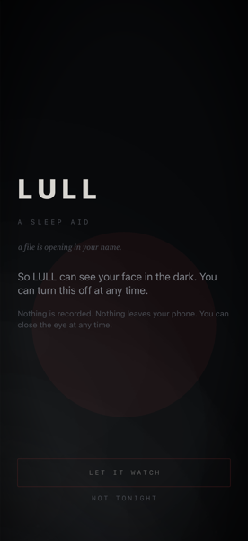
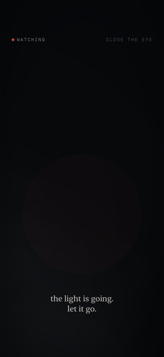
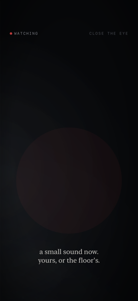
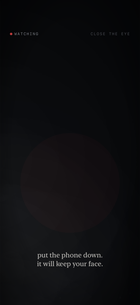
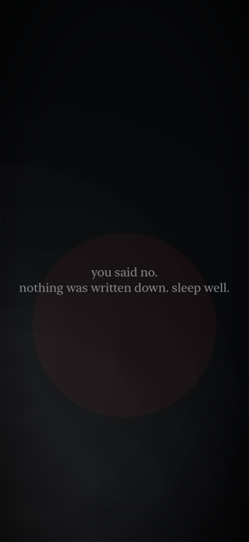
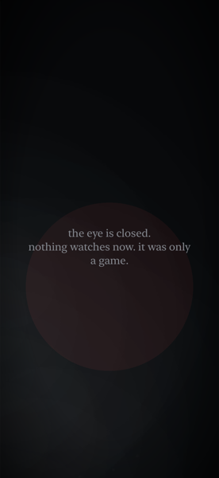

# LULL

*Working title — alts: HUSH / VIGIL / SOMNUS*

**A psychological horror game for iPhone that stops behaving like software.**
Built to be played once. Alone. In the dark.

<p>
  <a href="LICENSE"></a>
  
  
</p>

The pitch in one line: not "a scary game on a phone" — **the scary thing is the
phone.** It is in your hand, it has a camera on your face and a mic in your room,
it knows it is late, and it can reach you after you have closed it.

Inspired by the *spirit* of Hideo Kojima's **OD**: fear as the subject, the blur
between game and film, dread over gore, and the unknown — at a scale a small team
can actually build.

## The one rule — horror by permission, not violation

The binding constraint of the whole project (see [CLAUDE.md](CLAUDE.md)):

- Every sensor LULL touches is **opt-in, explained, and revocable.** Default is deny.
- **Hard boundaries:** nothing genuinely traumatizing, nothing deceptive, and
  **never** a glance at your photos, contacts, or location trails.
- The fear comes from what the player *knowingly* hands over, turned uncanny —
  not from what is taken.

Privacy-first is the decent thing here, and the only thing App Review will pass.
The allow-list is enforced **in code**: [`LULLKit`](LULLKit) has no way to even
*name* a forbidden sensor.

## Architecture

Reusing what the [MateMate chess project](https://github.com/testtest126/chess)
taught — SwiftUI craft, a
Vapor server we already know how to run, verify-don't-assume rigor, and a
privacy-audited foundation.

- **`LULLKit/`** — the shared Swift package: domain models + the consent
  foundation. Buildable and tested from commit one (the ChessKit pattern).
- **`app/`** — the SwiftUI iPhone app (the vertical slice, `THE EYE`). Built in
  Xcode via `app/project.yml` (XcodeGen); depends on `LULLKit`.
- **`server/`** *(later)* — the Vapor **haunt server**: content that shifts
  between sessions, seems to respond, and is quietly shared between players.
  MateMate's online/session stack, reused.

## The vertical slice: `THE EYE`

One fear mechanic — the front camera watching the player — executed flawlessly,
provable in about a week. The whole bet in one question: **does it make one
person, alone at night, put the phone face-down?** If yes, everything else is
worth building.

## Fear mechanics (iOS-native)

| mechanic | the device turned against you |
|---|---|
| **THE EYE** | the front camera — it watches you, and reacts to your face |
| **THE ROOM** | the microphone — it hears the silence, and what breaks it |
| **THE REACH** | a notification at 3am, while the app is closed |
| **THE HOUR** | it plays differently when it is late and the room is still |
| **THE PULSE** | a heartbeat in your palm, through haptics, not quite yours |
| **BEHIND YOU** | spatial audio, something just over your shoulder |

Full concept: [`docs/concept.md`](docs/concept.md).

## The voice — Kafka, Beckett, Poe, Bulgakov

LULL narrates in four literary registers. Three each own one act of the
experience; the fourth runs alongside them as a throughline:

| register | governs | the feeling |
|---|---|---|
| **Franz Kafka** | the threshold — consent | a record opening in your name; a verdict withheld |
| **Samuel Beckett** | the lull — the calm & the endings | waiting, the failing light, the nothing that is a mercy |
| **Edgar Allan Poe** | the watch — the escalation | the eye that will not blink; the heart beneath the floor |
| **Mikhail Bulgakov** | the guest — an aside through threshold, lull & watch | an urbane, amused observer, hospitable at first, who curdles into revealing he was never a guest at all |

It is a design language enforced in a **pure, tested, sensor-free** layer
([`Atmosphere`](LULLKit/Sources/LULLKit/Atmosphere.swift)) over the same phase
machine that drives the dread — so the writing is provable and can never widen
what the game is permitted to touch. Every line is **original prose in each
register, never a quotation**, and no author's name appears on screen to break
the spell.

## Screens

`THE EYE`, played start to finish. Captured on the Simulator, where the front
camera is a no-op — so these are the real vignette, copy, and phase states
LULL renders, just without a live face to react to.

<table>
<tr>
<td width="33%"></td>
<td width="33%"></td>
<td width="33%"></td>
</tr>
<tr>
<td>Consent, asked plainly — and refusable. This is the whole rule, on screen before anything else.</td>
<td>The eye opens. Kafka's threshold has closed; Poe's watch begins.</td>
<td>Escalation is pacing, not jump scares — the circle and the copy tighten together.</td>
</tr>
<tr>
<td width="33%"></td>
<td width="33%"></td>
<td width="33%"></td>
</tr>
<tr>
<td>Near the end of the watch — the register at its most direct.</td>
<td>Say no at the door and nothing happens. No guilt trip, no re-ask — that's the rule holding.</td>
<td>Close the eye mid-session and it lets go cleanly, in Beckett's register.</td>
</tr>
</table>

## Building & Running

Quickest path — one command, end to end (checks for XcodeGen, generates the
Xcode project, boots an available iPhone Simulator, builds, installs, and
launches `THE EYE`):

```sh
./run.sh
```

Needs a full Xcode install (not just the Command Line Tools) and
[XcodeGen](https://github.com/yonaskolb/XcodeGen) (`brew install xcodegen`) —
the script checks both and tells you what's missing. The front camera is a
no-op in the Simulator, so `THE EYE` opens but sees nothing there; build to a
real device (see [`app/README.md`](app/README.md)) to see it actually watch.

## Status

**v0.1 — the vertical slice.** `LULLKit` (consent, the `EyeSession` mechanic, and
the `Atmosphere` voice) is tested and green — 20 tests, green from commit one; the
SwiftUI + AVFoundation app in [`app/`](app) implements `THE EYE`, consent-gated,
speaking in the four registers above. Built in Xcode (see
[`app/README.md`](app/README.md)). Not scary yet — but it watches, it has a voice,
and it never breaks the rule.

## License

MIT — see [LICENSE](LICENSE). Build on it.
