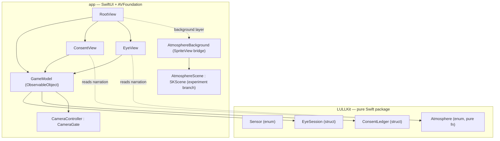
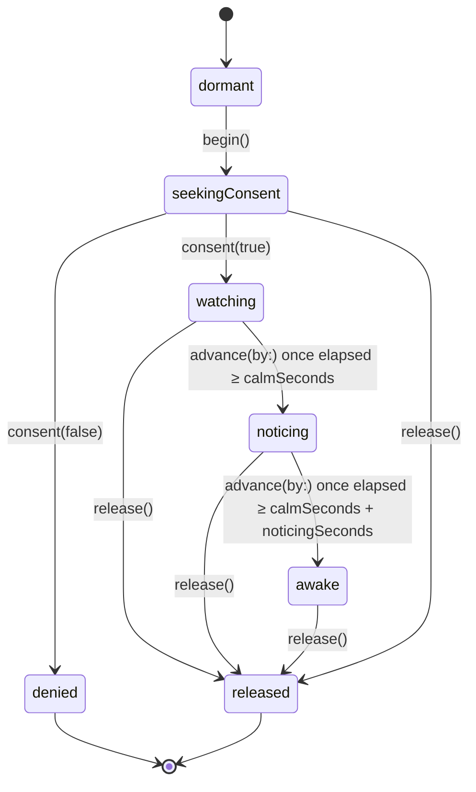

# Architecture

## Two targets

- **`LULLKit/`** — a standalone Swift package (`swift-tools-version:5.9`,
  iOS 17 / macOS 14). Domain models and the consent foundation: `Sensor`,
  `ConsentLedger`, `EyeSession`, `Atmosphere`. No SwiftUI, no AVFoundation, no
  UIKit — pure Swift, fully unit-testable without a simulator or device.
- **`app/`** — the SwiftUI iPhone app (the vertical slice, `THE EYE`). Depends
  on `LULLKit` as a local Swift package. Built via a generated Xcode project
  (`app/project.yml`, XcodeGen) — no `.xcodeproj` is committed.
- **`server/`** — referenced in the README as a later Vapor "haunt" backend.
  Not present in the repo yet; see [Roadmap / Ideas](Roadmap-Ideas).

`AtmosphereScene`/`AtmosphereBackground` exist only on the
`experiment/spritekit-atmosphere` branch — see
[Atmosphere (experiment)](Atmosphere-Experiment). Everything else above is on
`main`.

## `ConsentLedger` — the consent state

From `LULLKit/Sources/LULLKit/Consent.swift`. A small value type, not a state
machine: a `Set<Sensor>` of what's currently granted.

- `mayUse(_:)` — is this sensor usable right now. Default (empty set) is
  deny for everything.
- `grant(_:)` / `revoke(_:)` — per-sensor, explicit.
- `revokeAll()` — the panic switch: clears every grant at once.
- `activeSensors` — for an always-visible "LULL can see/hear you" indicator.

## `EyeSession` — the mechanic's state machine

From `LULLKit/Sources/LULLKit/Eye.swift`. `THE EYE`'s entire behavior is this
one `struct`, driven by `begin()`, `consent(_:)`, `advance(by:)`, and
`release()` — no camera, no UI, so it's fully unit-testable with fake time.

`release()` is callable from **any** phase — it's the panic switch made
concrete for this mechanic. `wantsCamera` is a derived, read-only property
(`true` only in `watching`/`noticing`/`awake`) that the app is meant to
consult before running the camera — see
[The Safety Invariant](The-Safety-Invariant) for exactly how that's wired
(and where the guarantee is weaker than it sounds).

`advance(by:)` clamps `dt` to `[0, 5]` seconds per call specifically so a
backgrounded app resuming with a huge time delta can't skip straight to
`.awake` — pinned by `testBackgroundingCannotFastForwardTheHorror` in
`EyeSessionTests.swift`.

## `Atmosphere` — the narration layer

From `LULLKit/Sources/LULLKit/Atmosphere.swift`. A **pure function** from
`EyeSession.Phase` (+ an elapsed-time-derived "beat") to a `Line` of text
tagged with a `Voice` (`kafka` / `beckett` / `poe`). It holds no state,
touches no hardware, and reaches no sensor — the app renders whatever it
returns and adds nothing of its own. This is also what lets the narration be
unit-tested (register-per-phase, beat-wrapping, "denial is always merciful")
without any UI.

## `CameraController` — the real camera

From `app/Sources/CameraController.swift`. Wraps a single `AVCaptureSession`
on the front camera behind the `CameraGate` protocol
(`requestAccess() / start() / stop()`), so `EyeSession`'s logic never needs
to know AVFoundation exists — tests can substitute a fake `CameraGate`.
`CameraPreview` (a `UIViewRepresentable`) renders the live `AVCaptureSession`
into SwiftUI; `EyeView` then deliberately degrades it (desaturated, blurred,
opacity-limited, vignetted) — the raw feed is never shown clean.

## `GameModel` — the glue

From `app/Sources/GameModel.swift`. An `ObservableObject` that owns one
`EyeSession`, one `ConsentLedger`, and one `CameraController`, and wires them
to a real 0.5s `Timer`. It contains no decisions of its own — every branch of
logic (does the eye escalate, is a sensor allowed) lives in `LULLKit` and is
tested there; `GameModel` just calls into it with real time and a real
camera.

## View layer

- **`ConsentView`** — the in-app rationale (`Sensor.camera.rationale`) shown
  *before* the OS permission prompt, with a real "Not tonight" decline.
- **`EyeView`** — the degraded camera preview plus narration, escalating
  opacity/blur/vignette by `EyeSession.Phase`, and an always-present
  "close the eye" control.
- **`RootView`** (in `LULLApp.swift`) — routes purely on `model.eye.phase`:
  `dormant`/`seekingConsent` → `ConsentView`, `watching`/`noticing`/`awake` →
  `EyeView`, `denied`/`released` → `EndingView`. The UI is a function of the
  state machine, nothing more.
- **`EndingView`** (also in `LULLApp.swift`) — renders the terminal narration
  line for `denied` or `released`.
